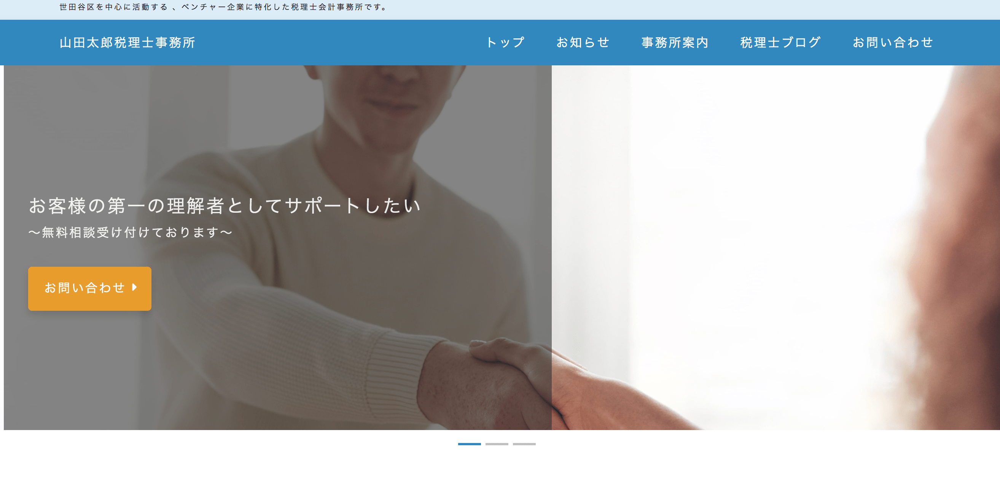

# 税理士事務所ホームページ(架空)

PHP フレームワーク Laravel を用いたアプリケーションです。
架空の大学の資料請求ページからフォームを送信することで、記入したメールアドレス宛に入力した内容をメールで送信します。

## デモサイト

[山田太郎税理士事務所](http://xd162417.wp.xdomain.jp/)
[モックアップ](http://xd162417.wp.xdomain.jp/)

## 開発環境

- macOS 10.13.6
- PHP 7
- WordPress
- Local by FlyWheel
- MySQL

## 概要

デザインからコーディング、WordPress 化まで担当しました。レンタルサーバーに Xserver(無料版)を使用しました。
カスタム投稿タイプを使用し、お知らせとブログ記事を分けて表示できるようにしました。パンくずリストやページネーションはプラグインを活用しています。

## 反省点

静的ページから WordPress 化するにあたり、WordPress が出力するクラス名と静的ページのクラス名が異なってしまったため、書き換える必要がありました。
タイポグラフィやレイアウトに工数がかかってしまったので、スターターテーマなど活用して効率的に作業ができればよかったです。
